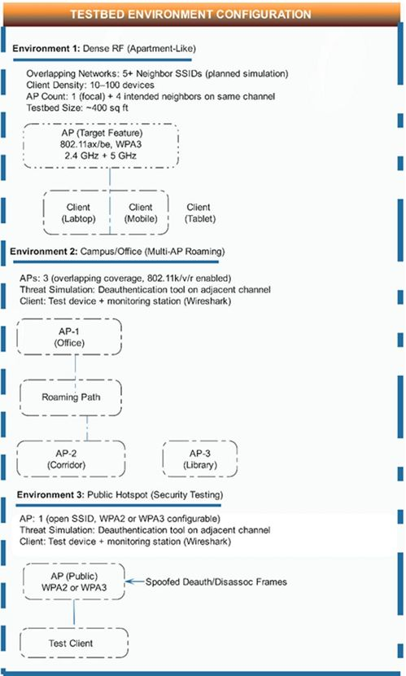
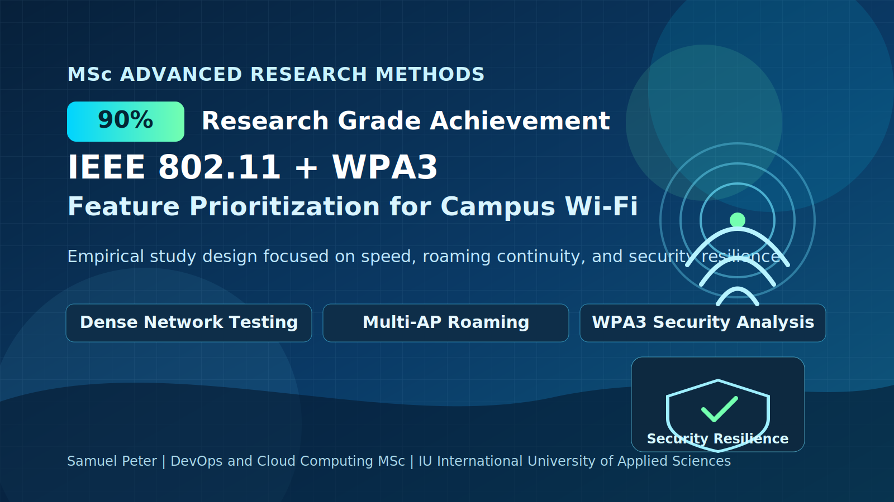

# WPA3 Adoption Gaps in Campus and Public Wi-Fi

This repository presents a research proposal focused on a practical business and operational challenge: many campuses and public hotspot operators still run mixed or legacy Wi-Fi security configurations, creating avoidable service disruption and security risk.

## Full Research Proposal (PDF)

- ARM2 submission PDF: [DLMARM01-01-ARM2.pdf](docs/DLMARM01-01-ARM2.pdf)

## Visual Outputs

### Testbed Environment Layout

Output: a clear view of the three test environments used to isolate congestion, roaming, and security feature effects.

### Research Feature Graphic

Output: a quick visual summary of the project focus on standards-based Wi-Fi upgrades and measurable operational outcomes.

## Business Problem

Campus IT and public hotspot operators must balance three pressures at once:
- Service reliability for cloud-first learning and collaboration workloads
- Security hardening against common Wi-Fi attacks (especially management-frame abuse)
- Budget constraints that force staged, high-ROI upgrades

In practice, many operators still rely on WPA2-heavy or mixed deployments and lack evidence on which features should be prioritized first. This creates a gap between standards guidance and day-to-day operational decision-making.

## Research Objective

To empirically evaluate which Wi-Fi feature upgrades provide the highest practical value in real-world-like campus and hotspot environments, with emphasis on:
- User-visible performance outcomes (throughput stability, latency, video continuity)
- Security resilience outcomes (attack success reduction, recovery behavior)
- Deployment prioritization under budget constraints

## Methodology (Overview)

The study uses a controlled testbed design across three environments:
- Dense/crowded Wi-Fi environment for congestion testing
- Multi-AP campus-like environment for roaming continuity testing
- Public hotspot security environment for WPA2 vs WPA3 resilience testing

Methods and analysis include:
- Feature ON/OFF comparative trials across repeated runs
- Cross-vendor validation with heterogeneous client/AP combinations
- Statistical analysis (paired comparisons, effect sizes, confidence intervals)
- Synthesis into a deployment-priority checklist for decision-makers

## Key Findings (Proposal-Derived)

Based on the literature synthesis and planned empirical framework, the expected high-confidence findings are:
- WPA3 with Protected Management Frames is likely to materially reduce successful deauthentication/disassociation attack impact versus legacy WPA2 configurations.
- Congestion-management features (for example OFDMA and spatial reuse techniques) are expected to improve user-visible throughput consistency in high-density scenarios.
- Roaming-assist features (802.11k/v/r) are expected to reduce handoff disruption for mobility-heavy use cases such as live video sessions across buildings.
- A staged upgrade model is likely to produce the strongest ROI: security baseline first (WPA3/PMF), then continuity and congestion optimizations, then next-generation spectrum/features as refresh cycles allow.

## Research-to-Practice

### How this research informs secure cloud networking / zero-trust deployments

The proposed evidence directly supports cloud and zero-trust architecture decisions:
- Identity-first access at the edge: WPA3/SAE and PMF strengthen network admission and reduce spoof-driven trust breaks before traffic reaches cloud controls.
- Improved policy reliability: fewer Wi-Fi session disruptions means more consistent enforcement of conditional access, device posture checks, and micro-segmentation policies.
- Better telemetry quality: cleaner, more stable wireless sessions reduce noise in SOC and SIEM workflows, improving anomaly triage for zero-trust operations.
- Prioritized modernization roadmap: teams can sequence controls by risk reduction and user impact, aligning Wi-Fi upgrades with broader secure access service edge (SASE) and zero-trust transformation programs.

## Repository Contents

- `proposal_task3.md` - detailed ARM proposal text
- `proposal.md` - earlier proposal variant
- `paper.md` - associated paper content
- `docs/DLMARM01-01-ARM2.pdf` - hosted ARM2 PDF for portfolio/reviewer access
- `assets/linkedin-featured-wifi-research.svg` - visual asset for portfolio promotion

## What Visitors Should Take Away

- This paper addresses a real deployment challenge: how to prioritize Wi-Fi security and reliability upgrades when budgets are limited.
- The proposal uses a structured, evidence-driven method to compare congestion, roaming, and security outcomes in realistic campus/public scenarios.
- The practical output is a decision-oriented roadmap that helps operators sequence upgrades by risk reduction and user impact.
- For full detail, start with the PDF, then use this README for the business context and implementation relevance.
